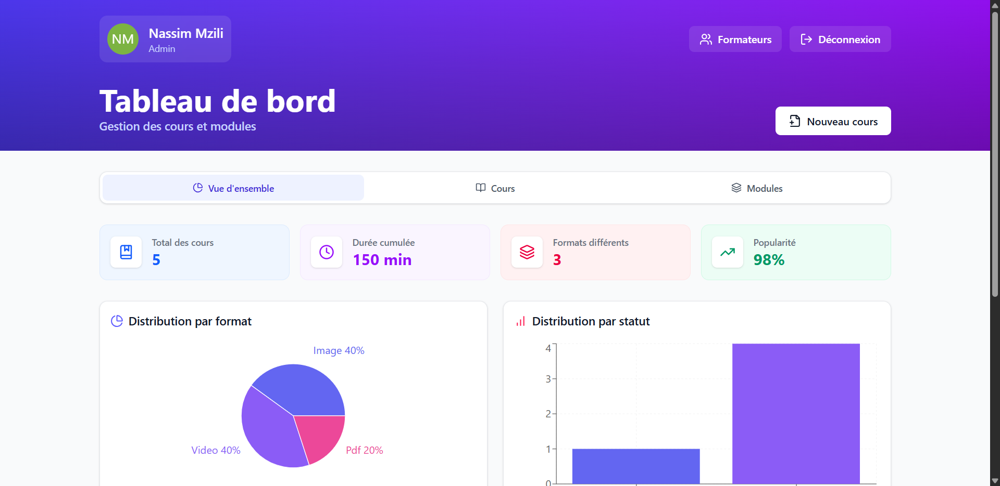

# Dashboard de Gestion de Cours

## Description

Ce projet est un dashboard permettant aux formateurs de créer et gérer des cours multimédias (textes, vidéos, images, fichiers PDF, etc.) pour leurs formations. L'application offre une interface intuitive pour ajouter, modifier, organiser et publier des contenus pédagogiques.

## Preview

Website Preview [ici](https://dashboard-formation.netlify.app/dashboard)



## Fonctionnalités

### Authentification & Autorisations

- Accès réservé aux utilisateurs avec le rôle « formateur » ou « administrateur »
- Sécurité via JWT

### Gestion des Cours

- Ajout de cours avec différents formats de contenu (vidéo, texte, image, PDF)
- Éditeur de texte enrichi (WYSIWYG)
- Upload de médias avec aperçu
- Organisation des cours (ordre, modules)
- Gestion des statuts (brouillon/publié)

### Interface Utilisateur

- Liste des cours avec actions (modifier, supprimer, changer l'ordre, dupliquer)
- Recherche et filtres
- Interface responsive (desktop et mobile)
- Design épuré et accessible (WCAG 2.1 niveau AA)

## Stack Technique

- **Frontend**: React, Tailwind CSS
- **Backend**: Node.js, Express
- **Base de données**: MongoDB
- **Authentification**: JWT

## Installation

### Prérequis

- Node.js (v14 ou supérieur)
- MongoDB
- npm ou yarn

### Installation du Frontend

```bash
cd client
npm install
npm run dev
```

### Installation du Backend

```bash
cd server
npm install
npm run start
```

## Développement

### Variables d'environnement

Créez un fichier `.env` dans le dossier server avec les variables suivantes :

```
PORT = 5000

MONGO_URI = your mongo uri OR mongodb://localhost:27017/your-db-name

JWT_SECRET = your_jwt_secret

NODE_ENV = development

NODEMAILER_USER = NodeMailer_user_email
NODEMAILER_PASSWORD = NodeMailer_user_password

CLIENT_URL = http://localhost:5173/
```

Créez un fichier `.env` dans le dossier client avec les variables suivantes :

```
VITE_SERVER_URL= your-backend-url or http://localhost:8888/api
```
